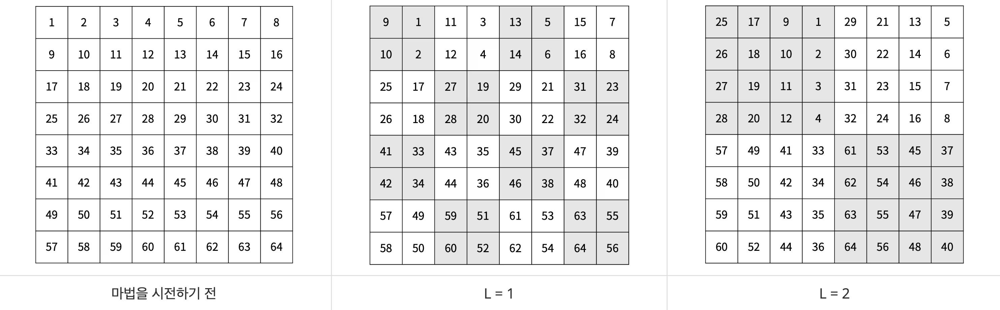

# 문제 링크
- https://www.acmicpc.net/problem/20058

# 문제 제약사항
시간 제한 | 메모리 제한 |
:-----: | :------: |
   1초   |   512MB   |

# 문제 설명
- 마법사 상어는 [파이어볼](https://www.acmicpc.net/problem/20056)과 [토네이도](https://www.acmicpc.net/problem/20057)를 조합해 파이어스톰을 시전할 수 있다. 오늘은 파이어스톰을 크기가 $2^N$ × $2^N$인 격자로 나누어진 얼음판에서 연습하려고 한다. 위치 (r, c)는 격자의 r행 c열을 의미하고, A[r][c]는 (r, c)에 있는 얼음의 양을 의미한다. A[r][c]가 0인 경우 얼음이 없는 것이다.
- 파이어스톰을 시전하려면 시전할 때마다 단계 L을 결정해야 한다. 파이어스톰은 먼저 격자를 $2^L$ × $2^L$ 크기의 부분 격자로 나눈다. 그 후, 모든 부분 격자를 시계 방향으로 90도 회전시킨다. 이후 얼음이 있는 칸 3개 또는 그 이상과 인접해있지 않은 칸은 얼음의 양이 1 줄어든다. (r, c)와 인접한 칸은 (r-1, c), (r+1, c), (r, c-1), (r, c+1)이다. 아래 그림의 칸에 적힌 정수는 칸을 구분하기 위해 적은 정수이다.

- 마법사 상어는 파이어스톰을 총 Q번 시전하려고 한다. 모든 파이어스톰을 시전한 후, 다음 2가지를 구해보자.
   1. 남아있는 얼음 A[r][c]의 합
   2. 남아있는 얼음 중 가장 큰 덩어리가 차지하는 칸의 개수
- 얼음이 있는 칸이 얼음이 있는 칸과 인접해 있으면, 두 칸을 연결되어 있다고 한다. 덩어리는 연결된 칸의 집합이다.

# 입/출력
## 입력
- 첫째 줄에 N과 Q가 주어진다. 둘째 줄부터 2N개의 줄에는 격자의 각 칸에 있는 얼음의 양이 주어진다. r번째 줄에서 c번째 주어지는 정수는 A[r][c] 이다.
- 마지막 줄에는 마법사 상어가 시전한 단계 L1, L2, ..., LQ가 순서대로 주어진다.

## 출력
- 첫째 줄에 남아있는 얼음 A[r][c]의 합을 출력하고, 둘째 줄에 가장 큰 덩어리가 차지하는 칸의 개수를 출력한다. 단, 덩어리가 없으면 0을 출력한다.

## 제한
- 2 ≤ N ≤ 6
- 1 ≤ Q ≤ 1,000
- 0 ≤ A[r][c] ≤ 100
- 0 ≤ $L_i$ ≤ N

# 예제 입/출력
## 예제 1번
### 입력
```text
3 1
1 2 3 4 5 6 7 8
8 7 6 5 4 3 2 1
1 2 3 4 5 6 7 8
8 7 6 5 4 3 2 1
1 2 3 4 5 6 7 8
8 7 6 5 4 3 2 1
1 2 3 4 5 6 7 8
8 7 6 5 4 3 2 1
1
```
### 출력
```text
284
64
```

## 예제 2번
### 입력
```text
3 2
1 2 3 4 5 6 7 8
8 7 6 5 4 3 2 1
1 2 3 4 5 6 7 8
8 7 6 5 4 3 2 1
1 2 3 4 5 6 7 8
8 7 6 5 4 3 2 1
1 2 3 4 5 6 7 8
8 7 6 5 4 3 2 1
1 2
```
### 출력
```text
280
64
```

## 예제 3번
### 입력
```text
3 5
1 2 3 4 5 6 7 8
8 7 6 5 4 3 2 1
1 2 3 4 5 6 7 8
8 7 6 5 4 3 2 1
1 2 3 4 5 6 7 8
8 7 6 5 4 3 2 1
1 2 3 4 5 6 7 8
8 7 6 5 4 3 2 1
1 2 0 3 2
```
### 출력
```text
268
64
```

## 예제 4번
### 입력
```text
3 10
1 2 3 4 5 6 7 8
8 7 6 5 4 3 2 1
1 2 3 4 5 6 7 8
8 7 6 5 4 3 2 1
1 2 3 4 5 6 7 8
8 7 6 5 4 3 2 1
1 2 3 4 5 6 7 8
8 7 6 5 4 3 2 1
1 2 0 3 2 1 2 3 2 3
```
### 출력
```text
248
62
```

## 예제 5번
### 입력
```text
3 10
1 2 3 4 5 6 7 8
8 7 6 5 4 3 2 1
1 2 3 4 5 6 7 8
8 7 6 5 4 3 2 1
1 2 3 4 5 6 7 8
8 7 6 5 4 3 2 1
1 2 3 4 5 6 7 8
8 7 6 5 4 3 2 1
1 2 3 1 2 3 1 2 3 1
```
### 출력
```text
246
60
```

## 예제 6번
### 입력
```text
3 10
1 0 3 4 5 6 7 0
8 0 6 5 4 3 2 1
1 2 0 4 5 6 7 0
8 7 6 5 4 3 2 1
1 2 3 4 0 6 7 0
8 7 0 5 4 3 2 1
1 2 3 4 5 6 7 0
0 7 0 5 4 3 2 1
1 2 3 1 2 3 1 2 3 1
```
### 출력
```text
37
9
```
